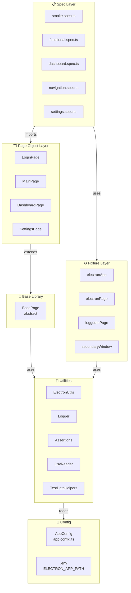
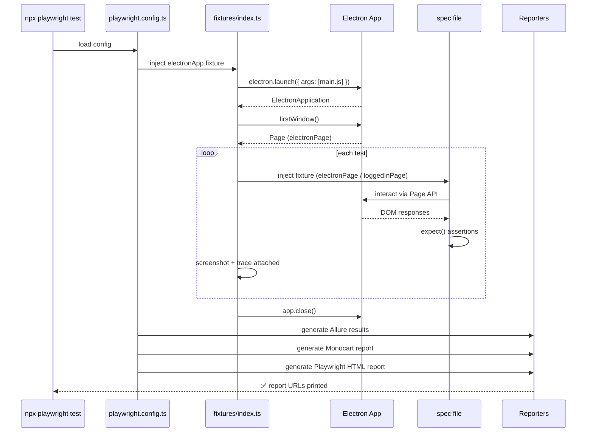
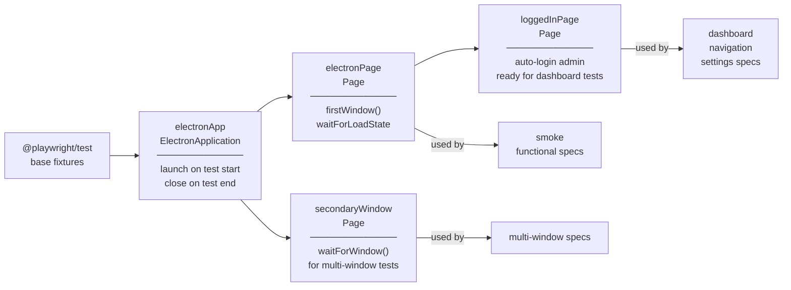
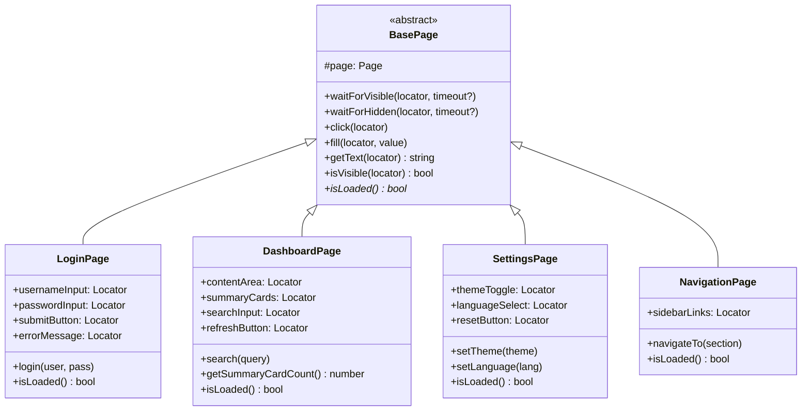
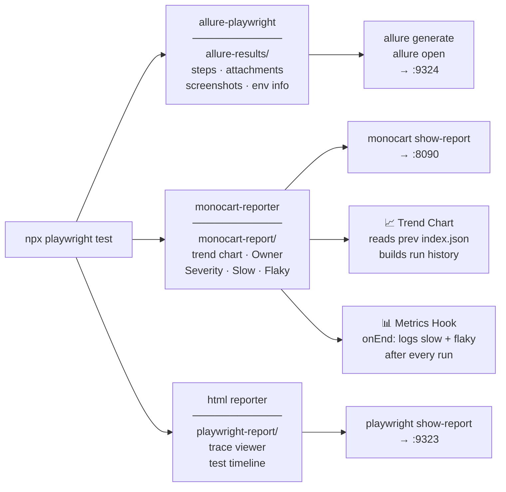
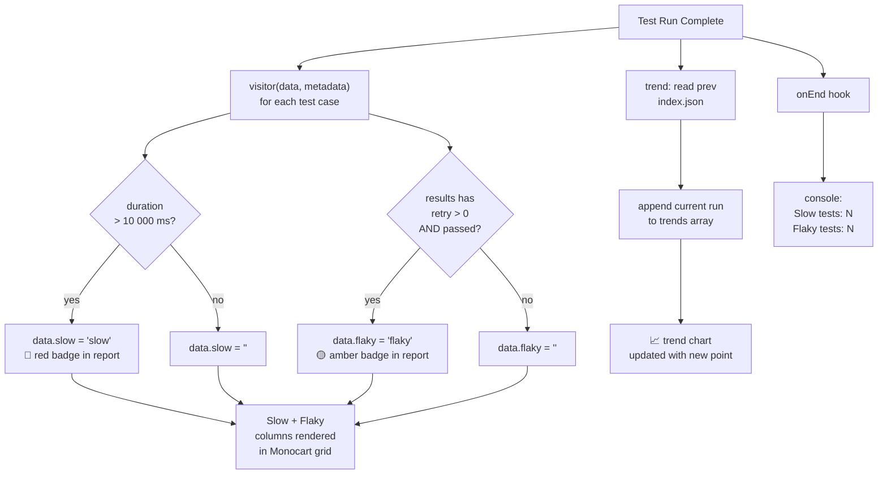
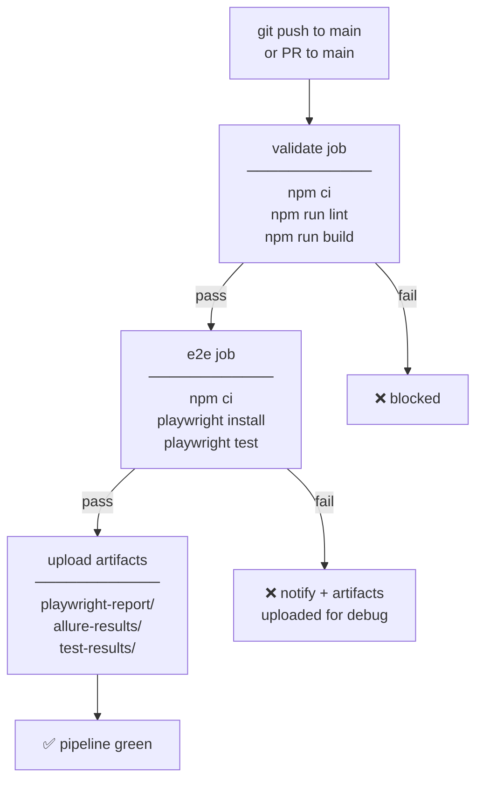

# Playwright Electron Framework — Diagrams

| | |
|---|---|
| **Owner** | QA Team |
| **Date** | 2026-06-05 |
| **Format** | Mermaid — renders on GitHub · export SVG/PNG for Lucidchart / Confluence |

---

## 1. Framework Architecture

---

## 2. Test Execution Lifecycle

---

## 3. Fixture Dependency Graph

---

## 4. Page Object Pattern

---

## 5. Reporting Pipeline

---

## 6. Monocart Custom Metrics Flow

---

## 7. CI/CD Pipeline

